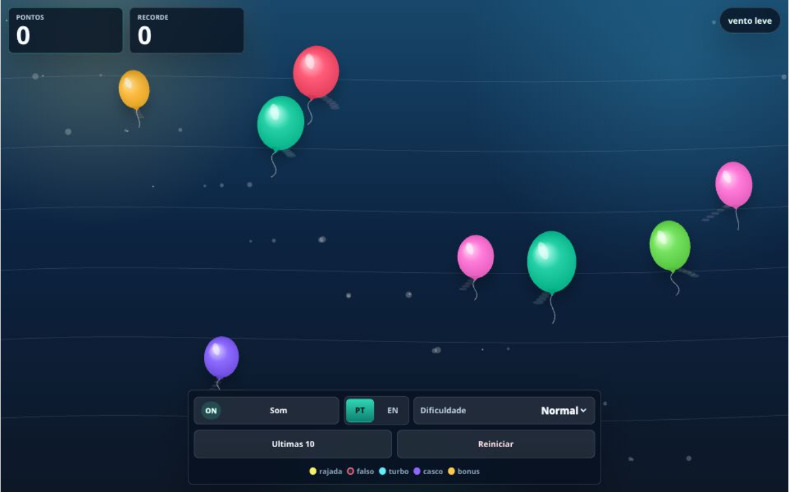

# Baloes Infinitos

[Read in English](README.md)

Baloes Infinitos e um pequeno jogo arcade em HTML5 feito com JavaScript puro, CSS e Canvas. Os baloes sobem pela tela com um movimento leve de vento; o jogador toca neles para estourar, marcar pontos e lidar com baloes especiais de bonus ou penalidade.



## Recursos

- Surgimento infinito de baloes com cores, velocidades e balanco aleatorios.
- Controles responsivos por mouse, toque e ponteiro, pensados para celulares.
- Pontuacao atual e recorde sempre visiveis.
- Recorde salvo no `localStorage` assim que e superado.
- Ultimas 10 pontuacoes salvas no `localStorage` e exibidas em modal.
- Configuracoes persistentes de som, dificuldade e idioma.
- Alternancia de idioma entre `pt-BR` e `en-US`.
- Movimento mais suave dos baloes com escala de entrada, trilhas de vento, feedback de escudo, particulas e ondas de estouro.
- Baloes especiais:
  - Balao de rajada: estoura todos os baloes visiveis e soma os pontos.
  - Balao falso: zera a pontuacao atual.
  - Balao turbo: faz os baloes subirem mais rapido por um tempo.
  - Balao casco: deixa os baloes temporariamente com escudo de tres toques.
  - Balao dourado: concede pontos extras.
  - Balao congelante: reduz o vento e a subida dos baloes brevemente.

## Estrutura do Projeto

```text
.
|-- index.html      # Marcacao do jogo, HUD, controles e modal
|-- styles.css      # Layout responsivo e estilo visual
|-- game.js         # Loop do Canvas, i18n, spawn, pontuacao, armazenamento e audio
|-- package.json    # Script de desenvolvimento
`-- README.md       # README em ingles
```

## Como Executar

O jogo e estatico e pode ser aberto diretamente no navegador:

```text
index.html
```

Para usar um servidor local de desenvolvimento, execute:

```bash
npm run dev
```

O script atual usa Vite via `npx`, entao nao e necessario manter dependencias instaladas no repositorio.

## Como Jogar

Estoure baloes normais para ganhar pontos. Os baloes especiais possuem pequenas diferencas de cor, forma, marca ou movimento. Alguns sao propositalmente disfarcados, entao jogadores atentos conseguem perceber detalhes sutis antes de tocar.

O jogo nao tem fim. Use o botao de reiniciar para salvar a rodada atual na lista de pontuacoes recentes e comecar novamente.

## Persistencia

O jogo salva dados no `localStorage` do navegador usando estas chaves:

- `balloonGame.highScore`
- `balloonGame.history`
- `balloonGame.sound`
- `balloonGame.difficulty`
- `balloonGame.locale`

## Notas de Desenvolvimento

- Mantenha o projeto leve e nativo do navegador.
- Prefira Canvas para desenhar objetos de gameplay.
- Mantenha controles acessiveis para mouse e toque.
- Mantenha textos visiveis do jogo no dicionario `I18N` em `game.js`.
- Ao adicionar novos baloes especiais, atualize legenda, desenho, comportamento de pontuacao e README.
